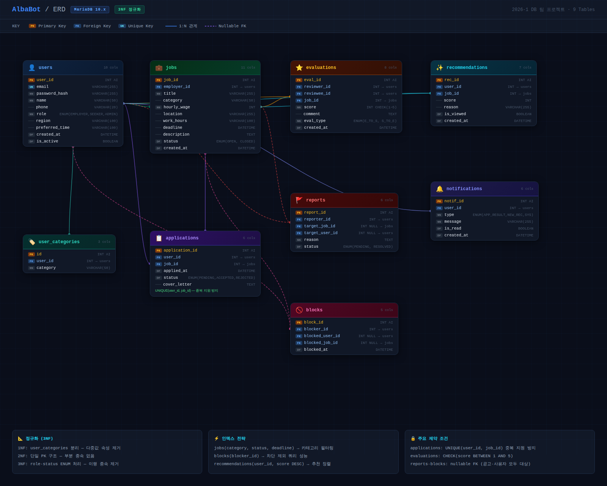

# AlbaBot — 개인화 기반 아르바이트 구인 매칭 시스템

2026-1 데이터베이스 팀 프로젝트

## 팀원

|이름 |역할                     |
|---|-----------------------|
|봉윤서|SQL 작성 · UI 개발 · 보고서 제출|
|하윤형|SQL 작성 · 프론트 개발        |
|김영민|SQL 작성 · 백엔드 개발        |

## 프로젝트 소개

구직자의 선호 카테고리, 지역, 평가 이력을 기반으로 맞춤형 아르바이트 공고를 추천하고, 부적절한 공고를 차단할 수 있는 구인 매칭 시스템입니다.

## 기술 스택

- Language: Java
- DB 연결: JDBC
- DBMS: MariaDB 10.x
- GUI 툴: HeidiSQL
- 협업: Git / GitHub

## 프로젝트 구조

```
albabot/
├── src/
│   ├── albabot_backend/     # DB 연결 관리 (DatabaseConnector)
│   ├── dao/                 # DB 접근 계층 (JobDao, ApplicationDao)
│   └── model/               # 데이터 모델 (Job, Application, User)
├── sql/
│   ├── 01_DDL.sql           # 테이블 생성
│   ├── 02_dummy_data.sql    # 테스트 데이터
│   └── 03_scenario_query.sql # 동작 시나리오별 쿼리
├── docs/
│   └── 정규화_검토보고서.docx
├── ERD_AlbaBot.png
└── README.md
```

## ERD



총 9개 테이블로 구성되어 있습니다.
`users`, `user_categories`, `jobs`, `applications`, `evaluations`, `reports`, `blocks`, `recommendations`, `notifications`

## 실행 방법

1. MariaDB에서 `albabot` 데이터베이스 생성
1. `sql/01_DDL.sql` 실행 (테이블 생성)
1. `sql/02_dummy_data.sql` 실행 (테스트 데이터 삽입)
1. `DatabaseConnector.java`에서 DB 접속 정보 수정
1. `mariadb-java-client.jar` classpath 추가 후 실행

## 주요 기능

|페이지   |기능                           |
|------|-----------------------------|
|로그인   |이메일/PW 검증, 로그인 실패 처리         |
|메인    |공고 목록 조회 (선호 카테고리 필터링), 공고 생성|
|게시글 상세|공고 상세 조회, 지원, 리뷰 작성          |
|마이 페이지|이력서 관리, 지원 현황 확인, 사용자 정보 조회  |

## 동작 시나리오

자세한 쿼리는 `sql/03_scenario_query.sql` 참고


**로그인**
이메일과 비밀번호를 입력하면 DB에서 사용자를 조회하고, 비밀번호가 일치할 경우 메인 페이지로 이동합니다. 불일치 시 로그인 실패 처리합니다.


**공고 지원**
게시글 상세 페이지에서 지원 버튼 클릭 시 중복 지원 여부를 먼저 확인합니다. 중복이 아닐 경우 applications 테이블에 저장하고 고용주에게 알림을 생성합니다. 두 작업은 트랜잭션으로 묶어 원자성을 보장합니다.


**공고 작성**


**맞춤 공고 탐색**
사용자의 선호 카테고리와 일치하는 공고만 필터링하고, 차단한 공고와 사용자의 공고는 자동으로 제외됩니다.

**리뷰 작성**
업무 완료 후 구직자와 고용주가 서로 평가할 수 있습니다. 본인이 올린 공고에는 리뷰를 작성할 수 없습니다.


**마이페이지**


## 기능 명세서


## 테이블 생성


## 테스트 코드 결과

Main에서 주석처리한 테스트 하드코드를 작동한 결과입니다. 테스트용으로 짠 코드라서 모든 필드 속성을 넣지 않았습니다.
- 1. 공고 글 db 삽입
- 2. 공고 글 db 업데이트
- 3. 공고 글 db 삭제
- 4. 사용자 공고 지원 db 삽입


## 정규화

3NF 기준으로 설계했습니다.

- 선호 카테고리는 `user_categories` 테이블로 분리해 1NF를 준수했습니다.
- `applications` 테이블에 UNIQUE(user_id, job_id) 제약을 추가해 중복 지원을 방지했습니다.
- `evaluations` 테이블에 CHECK(score BETWEEN 1 AND 5) 제약을 추가했습니다.
- 조회 성능을 위해 `jobs`, `blocks`, `recommendations` 테이블에 인덱스를 추가했습니다.

자세한 내용은 `docs/정규화_검토보고서.docx` 참고
